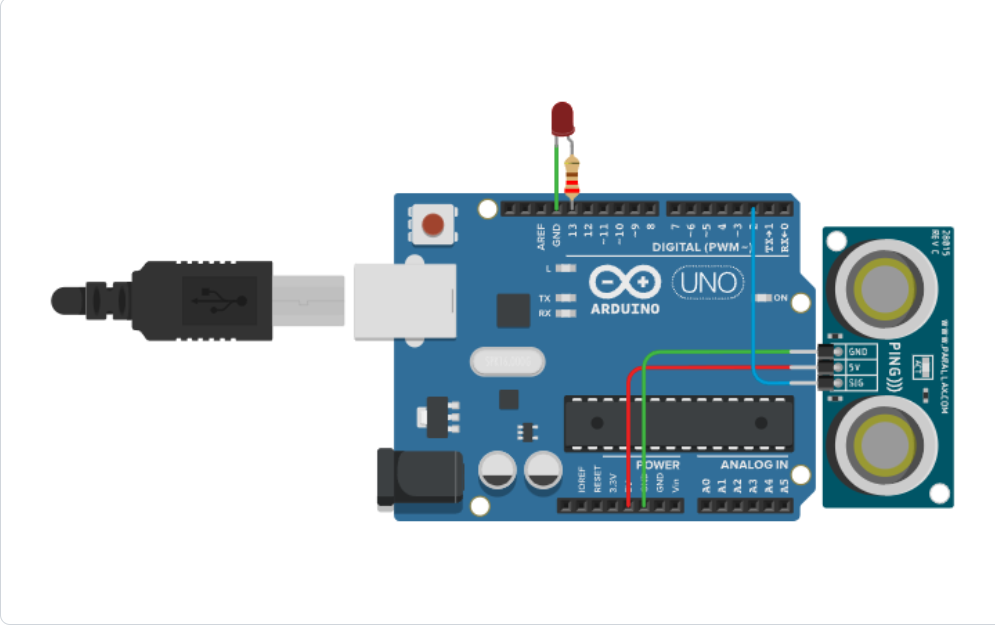

# 🌊 Sistema de Monitoramento de Nível da Água para Prevenção de Enchentes

## Visão geral do Aplicativo:
- Este aplicativo foi desenvolvido para monitorar o nível da água em áreas suscetíveis a enchentes. O sistema detecta alterações no nível da água e envia alertas aos usuários quando há risco de inundação, permitindo que medidas preventivas sejam tomadas com antecedência;
- Em poucas palavras, um monitor de enchente;

- Status de conclusão do projeto = Incompleto (Mais informações em "Considerações sobre o projeto" ao final do README)

### Divisão dos arquivos do projeto:
```text
Projeto---Monitor-de-Enchente (PME.)/
│
├── Arduino/
│   ├── Tinkercard - Links.md
│   ├── arduinocode.cpp
|   └── arduinotinker.png
│
├── site/
│   ├── templates/
|   |   └── index.html
|   |
│   ├── style.css
│   └── script.js
|
└── README.md
```

## Componentes que são necessários:
- Arduino Uno R3 - Físico;
- Um computador para enviar o código para o arduino e instalar a interface WEB + Códigos -.py.

## Arquivos necessários:
### Arduino:
* Arduino pelo Tinkercard (Guia de montagem): [SensorUmidade - Tinkercard](https://www.tinkercad.com/things/2vFZVZpT9EA-monitor-de-enchente?sharecode=XCLFaeLTbYF_APDIHi28YwsxTJyIfBrj8DvS4ARhXhg)


* Físico (Para Comprar): ["Kit Arduino Start" - ELETROGATE](https://www.eletrogate.com/kit-arduino-start?utm_source=Site&utm_medium=GoogleMerchant&utm_campaign=GoogleMerchant&gad_source=4&gad_campaignid=23952903735&gbraid=0AAAAADqxjs-XIeWP-YSaZxfLFrvQJx7ho&gclid=Cj0KCQjw9ZLSBhCcARIsAEhGKgN1l-aSubWQJe7-Aqt1lGT3C1Jk2ywa5hXJuTF-WEz076K30G8s2QMaAgxtEALw_wcB)

### Backend:
Rota = `PME\api\- `
* `app.py`
* `sensor.py`
* `LED.py`
### Interface Web:
Rota = `PME\site\-`
* `index.html` em `\templates\`
* `script.js`
* `styles.css`

## Como funciona:
De forma simplificada, o programa que consiste no monitoriamento da água das chuvas. Ele avisa ao cliente quando a água está em uma altura com possibilidade de enchente e alertar a ele:

1. O sensor ultrassonico monitora continuamente a distância da água relativa a uma superfíce -> Quanto mais perto, maior é o volume;
2. Os dados capturados pelo arduino, enviados em .json, e são processados pelo sistema desenvolvido em Python;
3. Quando o nível da água ultrapassa o limite considerado seguro, o alerta é acionado e enviado para o site;
4. O LED permanece ligado para indicar visualmente o risco de enchente no local analisado;
5. O usuário recebe a notificação no site, e após isso pode tomar as medidas necessárias de segurança.

## Considerações gerais sobre o projeto:
 Como citado na visão geral do aplicativo, o projeto está atualmente incompleto (21/07/2026) devido as seguinte questões:
 
 1. O grupo não conseguiu fazer a conexão entre os componentes necessário (arduino - api - site) apesar de ter feito cada um separadamente;
 2. O nível técnico diferente entre os membros do grupo influenciaram ao decorrer do projeto. Além disso, o prazo apesar de longo (média = 2,5 messes), foi quebrado em aulas onde membros do grupo faltaram e/ou não tiveram aula por teceiros (falta de água, feriado, etc.)

## Contribuições / Agradecimentos:
----| Projeto desenvolvido com a participação de:
* Carlito
* Ronald (Enzzo)
* Matheus
* Nunes
* Milly (Emilly)

## Bibliotecas usadas / Linguagens usadas:
- `Python`, `Java-script`, `HTML`, `CSS`, `C++`

* Agradecemos a todos os colaboradores extras que contribuíram para o desenvolvimento deste sistema de prevenção de enchentes.
